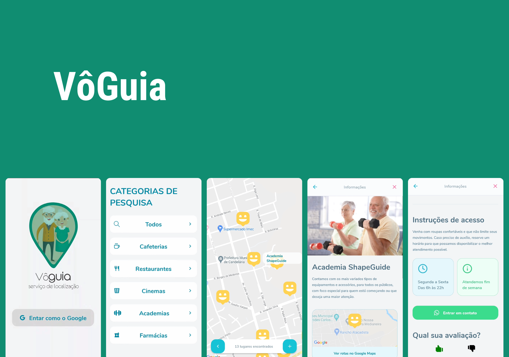
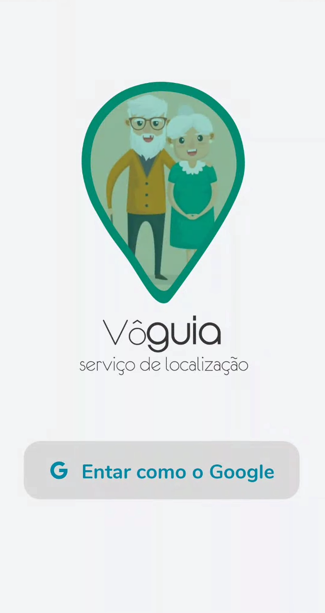
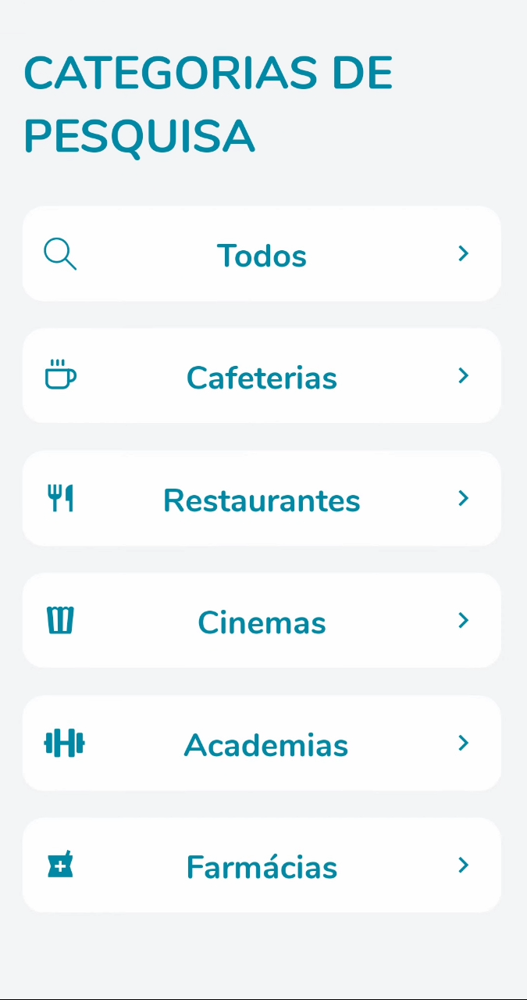
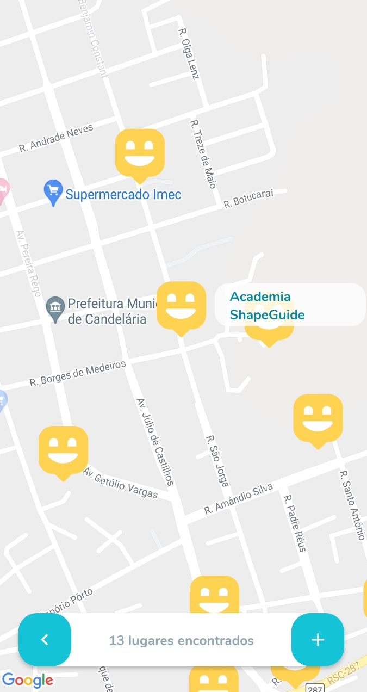
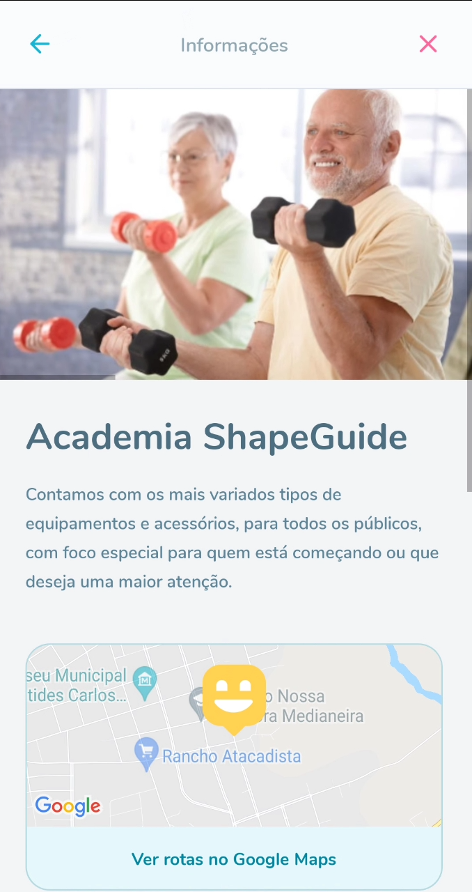
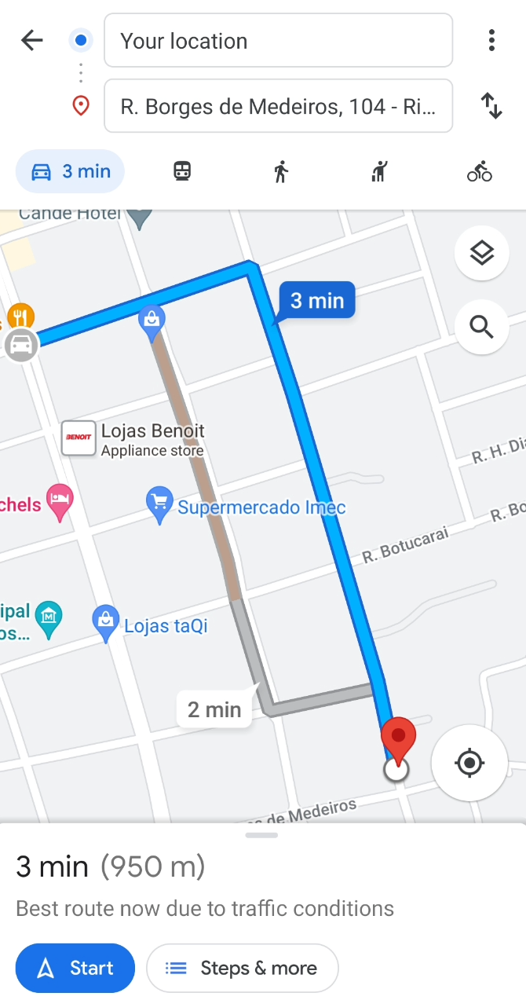

<h1 align="center">
    
</h1>

## 💻 Sobre o projeto

Motivado em fazer com que os idosos tenham entretenimento e acesso a locais diversificados e de qualidade, entregando de modo fácil e acessível recomendações qualificadas e rotas até o local de acordo com o seu interesse e sua localização.

O VoGuia é uma ferramenta que entrega um guia de locais de acordo com as necessidades do usuário. Dessa forma dependendo de suas peculiaridades será mostrado determinados locais e suas respectivas rotas por meio de um filtro pré estabelecido, totalmente individual de acordo com cada usuário.

Obs: Ainda não foi implementado um método de login. Mas na próxima atualização, a aplicação terá login social com o Google.

---

## ⚙️ Funcionalidades

- Pesquisar locais por categorias.
- Visializar locais recomendados.
- Rota até um local desejado.
- Avaliação do local.
- Entrar em contato via WhatsApp com algum responsável pelo local.

Para o desenvolvimento foram aplicados conceitos como:
- API integration
- Upload image
- Routes
- Typescript
- Models
- Views
- Controllers
- Migrations

---

## 🎨 Layout

### Mobile

  

  

  

  

  

  

---

## 🛠 Tecnologias
Principais ferramentas que foram usadas na construção do projeto:

#### **Backend**  [Node.js](https://nodejs.org/en)

-   **[Cors](https://www.npmjs.com/package/cors)**
-   **[Express](https://www.npmjs.com/package/express)**
-   **[SQLite3](https://www.npmjs.com/package/sqlite3)**
-   **[Multer](https://www.npmjs.com/package/multer)**
-   **[TypeORM](https://www.npmjs.com/package/typeorm)**
-   **[Yup](https://www.npmjs.com/package/yup)**

#### **Mobile**  [React Native](https://reactnative.dev/)

-   **[Axios](https://www.npmjs.com/package/axios)**
-   **[React Native Image Picker](https://github.com/react-native-image-picker/react-native-image-picker)**
-   **[React Native Maps](https://github.com/react-native-maps/react-native-maps)**
-   **[React Navigation](https://reactnavigation.org/)**

---

## 🦸 Autor

  
 <b>Everton Schultz</b></a>
  

